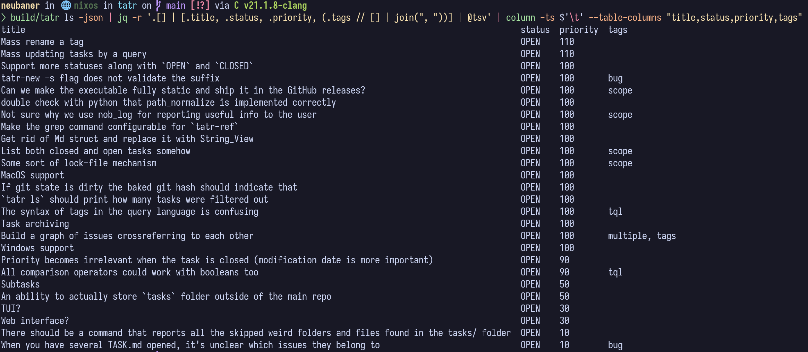

# JSON reports

- STATUS: OPEN
- PRIORITY: 80
- TAGS: scope

Interesting use case:

We could also implement all sorts of machine-friendly formats for the reports. Like XML and what not. But in the scope of this task let's focus on JSON only.
